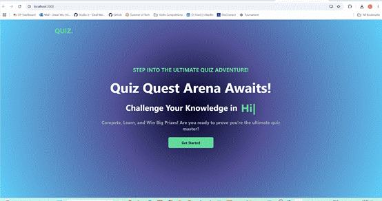
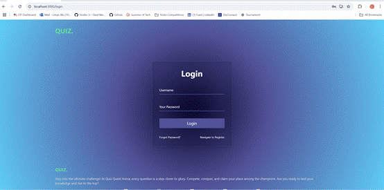
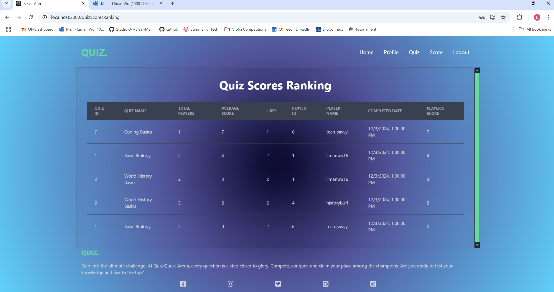
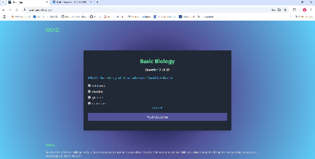
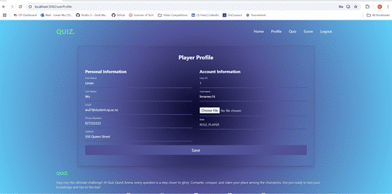

# QuizQuestArena (Full Stack: Spring Boot + React)

A full-featured quiz tournament platform where users can join live tournaments, answer questions in real-time, and view score rankings. Admins can manage tournaments, control game flow, and notify players. The system includes backend logic with Spring Boot + MySQL and a React frontend.

## 🚀 Overview

- Players register, login, and join tournaments
- Admin creates and manages tournaments (OpenTDB integrated for questions)
- Real-time multi-user quiz participation
- Role-based access (Player / Admin)
- Password reset, profile editing, and email notifications
- Score rankings, likes, and leaderboard
- Secure RESTful API design with Spring Boot backend

## 🛠 Technologies

### Backend
- Spring Boot 3.3.5 (Java 17)
- MySQL (Hibernate / Spring Data JPA)
- SMTP Email Notifications
- RESTful APIs

### Frontend
- React.js (ES6+)
- Axios for API communication
- Tailwind CSS (optional for UI)
- Responsive design

### DevOps / Version Control
- GitHub
- Maven / npm for builds

## 📌 Features

### User Features
- Register / Login / Logout
- Forgot password and email reset flow
- View and edit user profile
- Browse quizzes (ongoing, upcoming, past, participated)
- Participate in ongoing tournaments (single question per page)
- View results and receive feedback after completing quiz
- Like/unlike quizzes

### Admin Features
- Create quiz tournaments (name, category, difficulty, date range)
- Dynamic questions via OpenTDB (no hardcoding)
- Update and delete quizzes
- Email notifications to all users when a new quiz is created
- View all tournaments and manage them

### Gameplay Flow
- Players join ongoing tournaments
- Same randomised questions served to all players
- Correct/incorrect feedback after each answer
- Final score displayed after completion
- Scoreboard + likes viewable

## 📷 Screenshots

## 📝 How to Run

### Backend
1. Clone Backend repository
2. Open in IDE (IntelliJ, VSCode, etc.)
3. Configure `application.properties` (database, email SMTP)
4. Run Spring Boot app (default port `8080`)

### Frontend
1. Clone Frontend repository
2. `npm install` to install dependencies
3. `npm start` → runs on port `3000`

### Play
- Access frontend → register or login
- Join tournaments
- Play quizzes and view leaderboard

## 🎯 Future Improvements

- WebSocket integration for real-time multiplayer sync
- Admin quiz reporting and analytics
- OAuth social login (Google, GitHub)

## Author

**Liman Wu**

Backend Repo → [QuizQuestArena Backend](https://github.com/nvgrowold/QuizQuestArena-ReactCompatible-Backend)  
Frontend Repo → [QuizQuestArena Frontend](https://github.com/nvgrowold/QuizQuestArena-Frontend)
